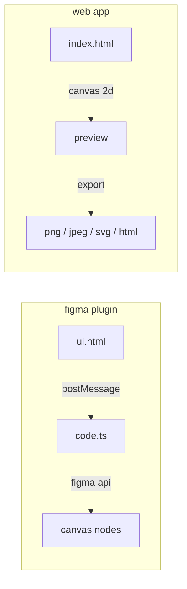
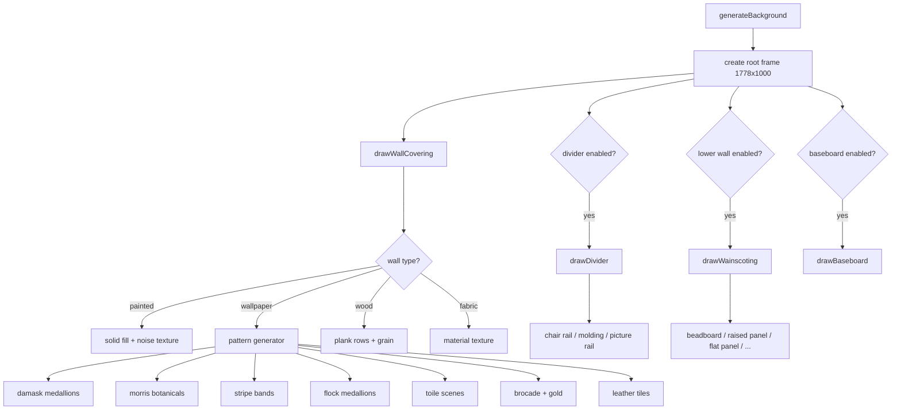
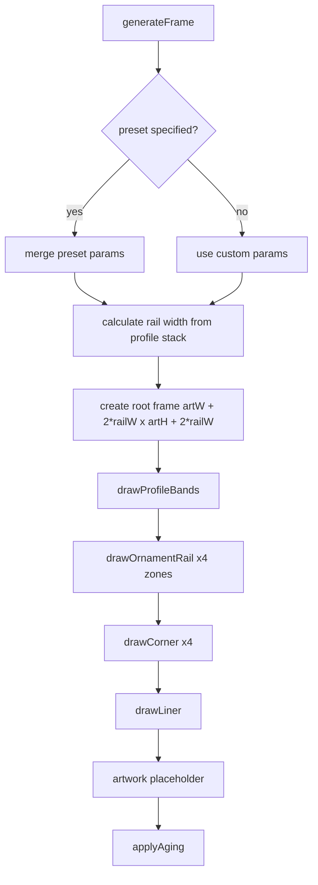
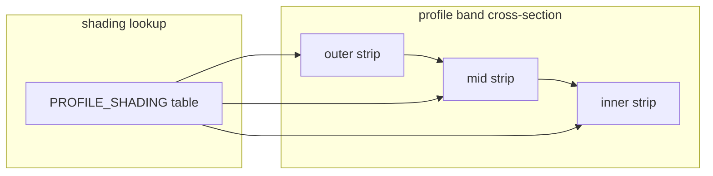
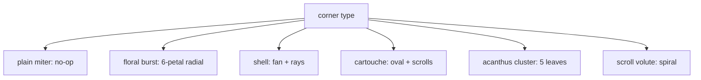
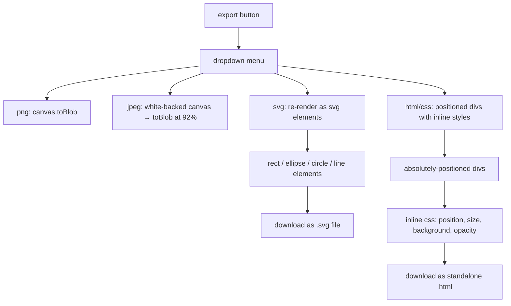
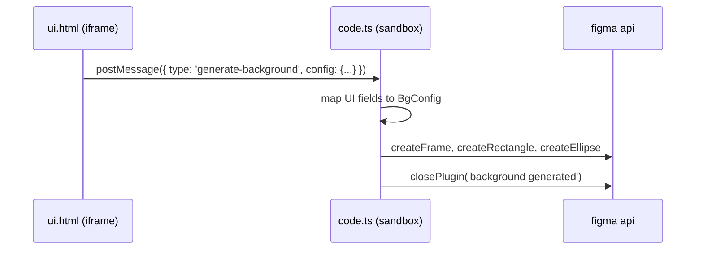

# under the hood

technical architecture and rendering pipeline for framewall.

---

## high-level architecture



the project has two rendering paths that share the same design logic but target different outputs:

| | figma plugin | web app |
|---|---|---|
| **renderer** | figma plugin api (rectangles, ellipses) | canvas 2d api |
| **output** | figma frame nodes on canvas | raster preview + multi-format export |
| **color model** | normalized rgb (0-1) | hex strings |
| **ui framework** | single html file in iframe | single html file in browser |

---

## wall generation pipeline



### zone layout

the wall is divided vertically into four zones. the bottom 35% is split between divider, lower wall, and baseboard:

```
┌─────────────────────────┐
│                         │ ← wall covering (upper 65%)
│    wallpaper / paint    │    handles: painted, wallpaper, wood, fabric
│    / wood / fabric      │
│                         │
├─────────────────────────┤ ← divider (chair rail / molding / picture rail)
│    lower wall           │ ← wainscoting (bottom 35% minus divider and baseboard)
│    (wainscoting)        │    handles: beadboard, raised panel, stone, etc.
├─────────────────────────┤
│    baseboard            │ ← 25px solid band with highlight
└─────────────────────────┘
```

### wallpaper pattern rendering

all wallpaper patterns use a tiled approach with seeded randomness for deterministic output.

**damask / flock / brocade** share a common medallion generator:
- center cartouche: bezier curve diamond shape
- flanking scrollwork: symmetric c-curves
- accent dots above and below
- flock uses larger spacing (160x180 vs 180x200) and higher opacity
- brocade adds gold accent color instead of tone-on-tone

**william morris** uses a stem-and-leaf system:
- vertical bezier stem
- paired elliptical leaves at alternating angles
- flower dot at top of each stem
- half-offset grid for organic feel

---

## frame generation pipeline



### profile band rendering

the core of the frame renderer. each profile primitive in the stack becomes a concentric band of rectangles.



each band is drawn as 4 rectangles per sub-strip (top rail, bottom rail, left rail, right rail), with 3 sub-strips per band:

```
band width = PROFILE_WIDTHS[primitive]  (e.g. ogee = 16px)

┌────────────────────────────────┐
│ outer (highlight or shadow)    │ ← stripW = floor(bandW / 3)
│ mid   (base or bump)          │ ← stripW
│ inner (shadow or highlight)   │ ← remaining
└────────────────────────────────┘
```

the shading values per profile type:

| profile | outer | mid | inner | visual effect |
|---------|-------|-----|-------|---------------|
| flat | 0 | 0 | 0 | no shading |
| ogee | +0.12 | 0 | -0.12 | light-to-dark s-curve |
| cushion | -0.06 | +0.10 | -0.06 | bright center bump |
| scoop | +0.06 | -0.10 | +0.06 | dark center hollow |
| bolection | +0.08 | +0.04 | -0.18 | dramatic projection |
| bead | +0.08 | +0.15 | -0.04 | bright rounded pearl |

relief shadow lines are drawn at each band boundary when `reliefDepth > 0`.

### ornament zone mapping

four ornament zones (A, B, C, D) are mapped proportionally across the profile bands:

```
zone A → band index floor(0/4 * bandCount) = outermost band
zone B → band index floor(1/4 * bandCount)
zone C → band index floor(2/4 * bandCount)
zone D → band index floor(3/4 * bandCount) = innermost band
```

each ornament type has a dedicated draw function in the `ORNAMENT_DRAW` lookup table. ornaments are placed along all 4 rails with spacing based on band width and coverage probability.

### corner treatment system

corners are drawn at 4 positions: `(railW/2, railW/2)` and mirrored. the `cornerAmplification` parameter scales the ornament relative to the corner area.



### aging system

aging applies post-processing overlays to simulate patina and wear:

```
light:  6% darkening overlay
medium: 12% darkening overlay + corner darkening
heavy:  22% darkening overlay + corner darkening + edge wear marks
```

the corner darkening uses 70% of rail width as the darkened area, at 1.5x the base opacity.

---

## color system

### figma plugin
uses hex strings internally with conversion to figma's normalized RGB (0-1 range):

```typescript
hexToRgb('#722F37') → { r: 0.447, g: 0.184, b: 0.216 }
```

`lighter()` and `darker()` work by lerping each channel toward white (1.0) or black (0.0):
```
lighter(hex, 0.15) → each channel += (1 - channel) * 0.15
darker(hex, 0.15)  → each channel *= (1 - 0.15)
```

### web app
uses hex strings throughout with integer RGB (0-255):
```javascript
shadeColor(hex, amt) → add amt to each RGB channel
mulColor(hex, factor) → multiply each RGB channel by factor
```

### palette
30 named museum colors covering:
- deep reds (burgundy, oxblood, museum red)
- blues (navy, oxford blue, deep teal)
- greens (forest green, bottle green, british racing green)
- neutrals (cream, ivory, charcoal, slate, warm gray)
- accents (terracotta, sage, plum, dusty rose, mauve)
- metallics/wood (gold, antique gold, champagne gold, silver leaf, bronze, mahogany, walnut, oak, black lacquer, gallery white)

---

## export system (web app)



### svg export
re-renders the entire design using svg primitives (`<rect>`, `<ellipse>`, `<circle>`, `<line>`) with proper opacity and rotation transforms. the svg is generated by walking through the same rendering logic as the canvas but outputting xml strings instead of canvas draw calls.

### html/css export
generates a standalone html page where each visual element becomes an absolutely-positioned `<div>` with inline css properties (position, dimensions, background color, opacity, optional border). the exported page is self-contained with no external dependencies.

---

## state management

### web app
two global state objects drive the rendering:

```javascript
bgState = {
  wallType, wallSubType, wallColor,
  dividerEnabled, dividerType,
  lowerEnabled, lowerType, lowerColor,
  baseboardEnabled, baseboardColor,
  width, height
}

frameState = {
  preset, profiles[],
  ornamentA, ornamentB, ornamentC, ornamentD,
  corners, finish, liner, aging,
  width, height
}
```

all UI changes update state and call `scheduleRender()`, which batches renders via `requestAnimationFrame` to avoid redundant draws.

### figma plugin
uses a message-passing architecture. the UI (iframe) sends `postMessage` with config objects to the plugin sandbox, which maps UI field names to internal config types and calls the generator functions.



---

## file architecture

### single-file approach
both the plugin UI and the web app are single HTML files with no build dependencies. this is intentional:

- no bundler, no npm, no framework
- drop `web/index.html` in a browser and it works
- the figma plugin UI loads directly as an iframe
- all css, js, and html in one file
- google fonts loaded via CDN link (poppins)

### plugin compilation
the figma plugin's `code.ts` is compiled to `code.js` by the figma plugin build system. the `ui.html` is served directly as the plugin iframe.
